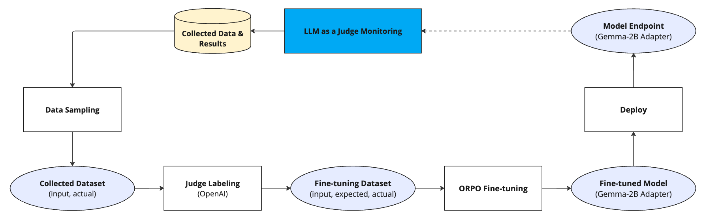

# Banking LLM monitoring and feedback loop demo

This demo showcases how to train, deploy, and monitor LLM using an approach described as [LLM as a judge](https://www.confident-ai.com/blog/why-llm-as-a-judge-is-the-best-llm-evaluation-method).

## Overview

This demo illustrates training an open-source model to answer banking-related questions only. It does this by analyzing the responses that were generated by the model traffic, and retraining the model according to the performance. The model performance analysis is done by a separate LLM that judges the results. Once the dataset is large enough, you can then retrain the model and mesure the performance again.



## Prerequisites

This demo requires an available GPU.

## Installation guide 

### Install and Import Requirements

This demo uses the following python packages:
* [mlrun](https://www.mlrun.org/) - Iguazio's MLRun to orchestrate the entire demo.
* [openai](https://openai.com/) - OpenAI's ChatGPT as the LLM Judge.
* [transformers](https://huggingface.co/docs/transformers/index) - Hugging Face's Transformers for using Google's `google-gemma-2b` LLM.
* [datasets](https://huggingface.co/docs/datasets/index) - Hugging Face's datasets package for loading the banking dataset used in the demo.
* [trl](https://huggingface.co/docs/trl/index) - Hugging Face's TRL for the ORPO fine-tuning.
* [peft](https://huggingface.co/docs/peft/index) - Hugging Face's PEFT for the LORA adapter fine-tuning.
* [bitsandbytes](https://huggingface.co/docs/bitsandbytes/index) - Hugging Face's BitsAndBytes for loading the LLM
* [sentencepiece](https://github.com/google/sentencepiece) - Google's tokenizer for Gemma-2B.

> Note: This demo uses the gemma-2b model by Google. This model is publicly accessible, but if you want to use it then you have to first read and accept
its terms and conditions. Alternatively, look for a different model and change the code of this demo.

```
import sys

%pip install -U -r requirements.txt
if sys.version_info.major == 3 and sys.version_info.minor == 9:
    %pip install protobuf==3.20.3
```

```
import os
import random
import time
import dotenv   
import pandas as pd
from tqdm.notebook import tqdm
from datasets import load_dataset
import sys
import shutil
import mlrun
from mlrun.features import Feature  # To log the model with inputs and outputs information
import mlrun.common.schemas.alert as alert_constants  # To configure an alert
from mlrun.model_monitoring.helpers import get_result_instance_fqn  # To configure an alert

from src.llm_as_a_judge import OpenAIJudge
pd.set_option("display.max_colwidth", None)
```

### Set Credentials

* **Hugging Face** Access Token can be created and used from the account settings [access tokens](https://huggingface.co/settings/tokens). 
* **OpenAI** Secret API key can be found on the [API key page](https://platform.openai.com/api-keys)

```
dotenv.load_dotenv() #you can create a .env file with the following variables, HF_TOKEN, OPENAI_API_KEY, OPENAI_BASE_URL

OPENAI_MODEL = "gpt-4o"
```

### Create an MLRun Project
```
# Create the project:
project = mlrun.get_or_create_project(
    name="llm-monitoring",
    parameters={"image":".llm-serving",
        "node_selector": None, # Change to a node selector that is used in GPUs nodes
    },
    user_project = True,
    context="./src",
)
```
**Enable model monitoring:**
```
from src.model_monitoring_utils import enable_model_monitoring

# If this project was running with MM enabled pre-1.8.0, disable the old model monitoring to update configurations
project.disable_model_monitoring(delete_stream_function=True)

enable_model_monitoring(project=project, base_period=2)
```

## Demo flow

1. LLM as a Judge

- **Notebook**: [llm-monitoring-main.ipynb](llm-monitoring-main.ipynb)
- **Description**: Usa a dataset and two types of prompt templates (to understand the difference) and get the LLM to function well as a judge.   
- **Key steps:**
  - Load the banking dataset
  - Create an accuracy metric
  - Create the evaluation set
  - Prompt engineering the judge
- **Key files:**
  - llm_as_a_judge
  - model_monitoring_utils

2. MLRun's Model Monitoring

- **Notebook**: [llm-monitoring-main.ipynb](llm-monitoring-main.ipynb)
- **Description**: Deploy model monitoring and the `google-gemma-2b` LLM
- **Key steps:**
  - Deploy the model monitoring application
  - DeepEval model monitoring function
  - Deploy the LLM
  - Configure an alert
  - Check the performance of the base model
  - Evaluate the model using DeepEval on banking and non-banking questions
- **Key files:**
  - llm_as_a_judge
  - deepeval_as_a_judge
  - model-iris

3. ORPO Fine-tuning

- **Notebook**: [llm-monitoring-main.ipynb](llm-monitoring-main.ipynb)
- **Description**: Create a fine-tuned model that only answers banking-questions.    
- **Key steps:**
  - Build the training set
  - Fine-tune the model
  - Check the performance 
  - Evaluate the model using DeepEval